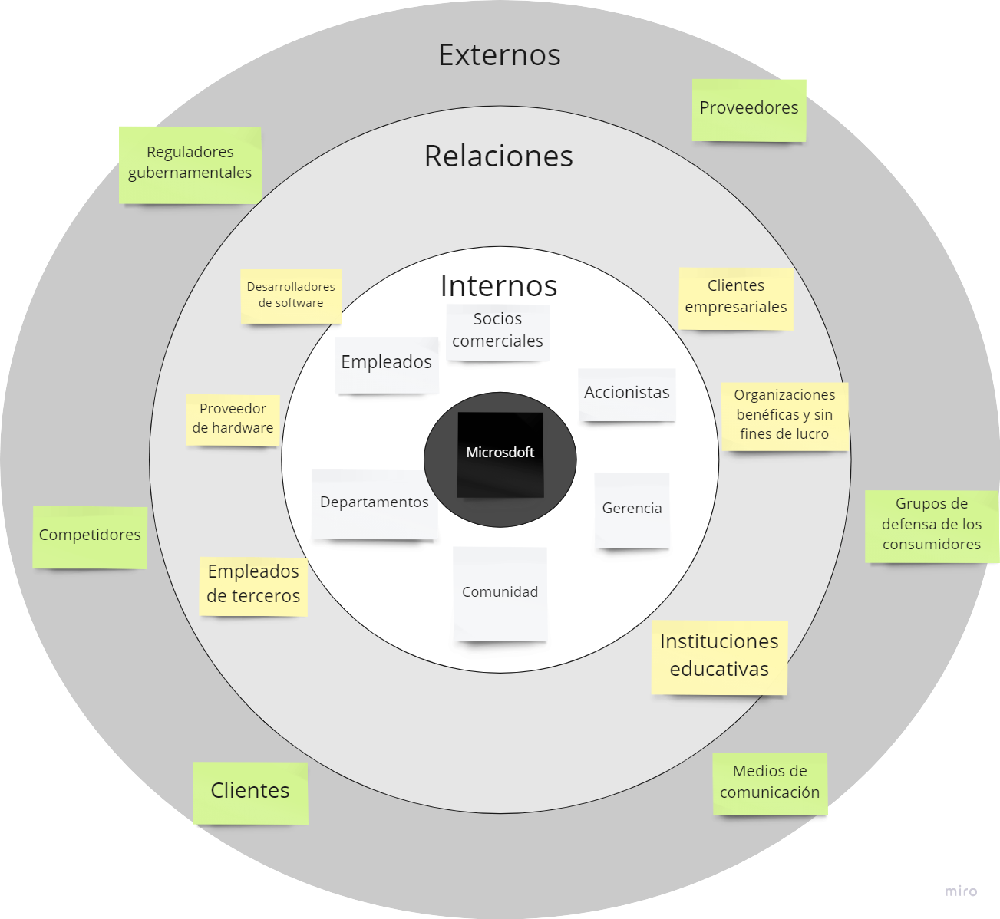
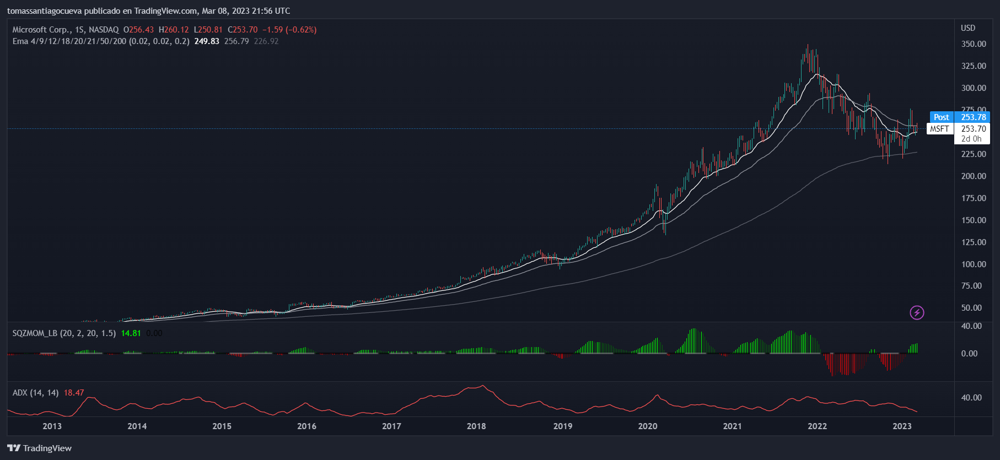
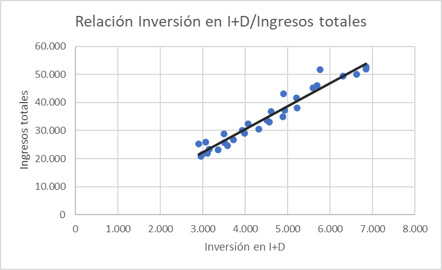
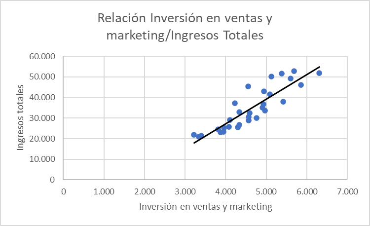

```{r setup, include=FALSE}
knitr::opts_chunk$set(echo = TRUE)
options(scipen = 999)
```

# Pre-entrega - Cueva Tomas

```{r import_libraries,echo=FALSE,message=FALSE,warning=FALSE}
library(tidyverse)
library(dplyr)
library(readxl)
library(DT)
library(knitr)
library(kableExtra)
library(htmltools)
library(htmlwidgets)
```

## Propósito

Había una vez una empresa que revolucionó la industria tecnológica y se convirtió en un referente mundial. Esa empresa es Microsoft, y en este informe vamos a profundizar en su historia y su actualidad, para que puedan entender su valor y su potencial de crecimiento.

Primero, vamos a conocer quién es Microsoft, su misión, visión y valores. Después, analizaremos los diferentes grupos de interés que conforman su ecosistema y cómo interactúan con la compañía. Luego, abordaremos el modelo de negocio de Microsoft, su propuesta de valor y cómo se relaciona con sus clientes. También vamos a compararla con sus principales competidores en el mercado.

Posteriormente, vamos a analizar la salud financiera de la empresa, cómo ha sido su crecimiento en ganancias y cómo ha impactado en el precio de sus acciones en el mercado de valores. Para finalizar, realizaremos un análisis de regresión para predecir los ingresos totales de Microsoft y determinar cuál es la mejor variable para hacerlo.

Este informe está destinado a inversores y accionistas que desean entender la situación actual y el potencial futuro de Microsoft. Les invitamos a adentrarse en este viaje y descubrir cómo esta empresa, que cambió la forma en que interactuamos con la tecnología, está lista para liderar el futuro de la industria.

# Misión, visión y valores

Hace más de cuatro décadas, en una pequeña ciudad de Estados Unidos, un joven Bill Gates y su socio Paul Allen crearon una compañía que cambiaría para siempre el mundo de la tecnología: Microsoft.

Desde entonces, Microsoft ha evolucionado y se ha expandido en un gigante global, pero una cosa siempre ha permanecido constante: su compromiso con su misión, visión y valores.

La misión de Microsoft es empoderar a cada persona y organización en el planeta para lograr más. Esta misión inspira a Microsoft a crear productos innovadores y soluciones tecnológicas que permiten a las personas trabajar de manera más inteligente y efectiva, mejorar la vida diaria y hacer posible lo imposible.

La visión de Microsoft es crear tecnología que transforme el mundo y tenga un impacto positivo en la sociedad. La compañía tiene una visión clara y audaz de lo que puede lograr a través de la innovación y el liderazgo en el mercado, y se esfuerza por alcanzarla cada día.

Los valores de Microsoft son fundamentales para su éxito como empresa. La compañía se guía por cinco valores centrales: integridad y honestidad, respeto, trabajo en equipo, innovación y satisfacción del cliente. Estos valores están arraigados en todo lo que hace Microsoft, desde la forma en que interactúa con sus clientes y empleados, hasta cómo diseña y desarrolla sus productos.

En resumen, Microsoft no solo es una empresa tecnológica líder en el mundo, sino también una empresa comprometida con su misión, visión y valores. Su dedicación a empoderar a las personas y organizaciones en todo el mundo, crear tecnología innovadora y guiarse por valores sólidos son lo que la convierte en una empresa única y exitosa en la industria tecnológica.

# Stakeholders

En la historia de Microsoft, los stackholders han sido una pieza clave en su éxito empresarial. Desde el comienzo, la empresa ha buscado construir relaciones sólidas y sostenibles con todos los actores relevantes en su operación y crecimiento.

En esta sección nos encargaremos de analizar los stackholders principales de la empresa.

## Onion map e interpretación

{width="70%"}

Stakeholders internos:

1.  Empleados: los empleados de Microsoft son uno de los principales stakeholders internos de la empresa. Como tal, están interesados en el éxito de la compañía y en el crecimiento de sus carreras.

2.  Accionistas: los accionistas son propietarios de la empresa y tienen un interés directo en el desempeño financiero de la compañía, así como en el aumento del valor de sus acciones.

3.  Gerencia: la gerencia de Microsoft está interesada en el éxito financiero y en la reputación de la compañía, y en asegurarse de que la empresa cumpla con sus objetivos a largo plazo.

4.  Departamentos: cada departamento dentro de Microsoft tiene sus propios intereses, ya sea en el desarrollo de productos, marketing, ventas, etc. El éxito de la empresa está estrechamente vinculado al éxito de cada uno de sus departamentos.

5.  Socios comerciales: los socios comerciales de Microsoft son stakeholders internos porque sus productos y servicios están integrados en la oferta de la empresa, lo que puede tener un impacto directo en la rentabilidad de Microsoft.

6.  Comunidad: la comunidad local y global en la que opera Microsoft es un stakeholder interno, ya que la compañía puede tener un impacto directo en la economía local, la educación y otros aspectos importantes de la vida comunitaria.

Relaciones con interesados

1.  Proveedores de hardware: las empresas que proporcionan hardware para los productos de Microsoft, como fabricantes de chips y dispositivos, son importantes para el éxito de la empresa y podrían ser incluidos en el Onion map de stakeholders.

2.  Desarrolladores de software: los desarrolladores de software de terceros que crean aplicaciones que se ejecutan en los sistemas operativos de Microsoft, como Windows y Azure, son cruciales para el ecosistema de software de la empresa y, por lo tanto, también son stakeholders importantes.

3.  Clientes empresariales: los clientes empresariales que utilizan los productos y servicios de Microsoft para su negocio pueden ser considerados stakeholders clave, ya que su éxito empresarial depende en cierta medida del éxito y la fiabilidad de las soluciones de Microsoft.

4.  Organizaciones benéficas y sin fines de lucro: Microsoft ha establecido iniciativas filantrópicas significativas, incluyendo la Fundación Bill y Melinda Gates y el Programa de Donaciones de Software, y por lo tanto, las organizaciones benéficas y sin fines de lucro que se benefician de estos esfuerzos también pueden ser consideradas stakeholders.

5.  Instituciones educativas: dado que Microsoft tiene un fuerte enfoque en la educación y ha desarrollado muchos productos y servicios diseñados específicamente para su uso en el aula, las instituciones educativas, como escuelas, universidades y organizaciones de formación, también podrían ser consideradas stakeholders.

6.  Empleados de terceros: las personas empleadas por empresas que trabajan en estrecha colaboración con Microsoft, como consultores y contratistas, también pueden ser consideradas stakeholders, ya que su éxito y seguridad financiera también dependen del éxito de Microsoft.

Stakeholders externos:

1.  Clientes: los clientes son uno de los principales stakeholders externos de Microsoft. Están interesados en productos y servicios de calidad, precio justo, y buen soporte técnico.

2.  Competidores: los competidores de Microsoft están interesados en la innovación y el éxito financiero de la compañía, ya que pueden tener un impacto directo en su propia posición en el mercado.

3.  Reguladores gubernamentales: los reguladores gubernamentales están interesados en asegurarse de que Microsoft cumpla con todas las leyes y regulaciones aplicables, y en garantizar que la compañía no abuse de su posición dominante en el mercado.

4.  Proveedores: los proveedores de Microsoft están interesados en el éxito de la compañía, ya que su propia rentabilidad y éxito están vinculados a la satisfacción de Microsoft con sus productos y servicios.

5.  Grupos de defensa de los consumidores: los grupos de defensa de los consumidores están interesados en garantizar que los productos y servicios de Microsoft sean seguros y de calidad, y en proteger los derechos de los consumidores.

6.  Medios de comunicación: los medios de comunicación están interesados en informar a sus audiencias sobre el desempeño y la reputación de Microsoft, así como en evaluar la calidad de sus productos y servicios.

# Canvas model

Socios clave:

1.  Fabricantes de hardware: Microsoft colabora con fabricantes de hardware para asegurar la compatibilidad de sus sistemas operativos y aplicaciones con dispositivos de terceros.

2.  Desarrolladores de software: Microsoft trabaja con desarrolladores de software para crear aplicaciones y juegos que se ejecuten en su plataforma Windows.

3.  Proveedores de servicios en la nube: Microsoft colabora con proveedores de servicios en la nube para ofrecer soluciones de infraestructura y plataforma como servicio a sus clientes.

Actividades clave:

1.  Desarrollo de software: Microsoft dedica una gran cantidad de recursos a la investigación y desarrollo de nuevos productos y servicios de software.

2.  Marketing y publicidad: Microsoft lleva a cabo actividades de marketing y publicidad para promocionar sus productos y servicios a nivel mundial.

3.  Gestión de relaciones con clientes: Microsoft gestiona activamente sus relaciones con clientes a través de su servicio de atención al cliente y soporte técnico.

Recursos clave:

1.  Capital humano: Microsoft cuenta con un equipo de expertos en ingeniería de software, marketing y ventas.

2.  Propiedad intelectual: La empresa posee una gran cantidad de patentes y derechos de autor sobre su software y tecnología.

3.  Centros de datos y servidores: Microsoft dispone de centros de datos y servidores en todo el mundo para ofrecer servicios en la nube a sus clientes.

Propuesta de valor:

1.  Productos y servicios de software de alta calidad: Microsoft es conocida por su software de alta calidad, que abarca desde sistemas operativos hasta aplicaciones empresariales y juegos.

2.  Servicios en la nube: Microsoft ofrece servicios en la nube como Azure, que proporcionan a las empresas una amplia gama de servicios y soluciones de infraestructura y plataforma como servicio.

3.  Innovación constante: Microsoft se esfuerza por mantenerse a la vanguardia de la tecnología, y constantemente desarrolla nuevas soluciones y servicios para satisfacer las necesidades de sus clientes.

Relación con clientes:

1.  Venta directa: Microsoft vende muchos de sus productos directamente a los clientes a través de su sitio web y tiendas físicas.

2.  Asociaciones de canal: Microsoft trabaja con socios y distribuidores de canal para llegar a más clientes y aumentar su alcance global.

3.  Soporte técnico: Microsoft ofrece un servicio de soporte técnico de alta calidad a sus clientes para ayudarles a resolver problemas y responder preguntas.

Canales:

1.  Tiendas físicas: Microsoft cuenta con una red de tiendas físicas en todo el mundo donde los clientes pueden comprar productos y obtener soporte técnico.

2.  Sitio web: Microsoft ofrece la venta de sus productos y servicios en su sitio web, así como recursos de soporte técnico y documentación.

3.  Distribuidores de canal: Microsoft trabaja con socios y distribuidores de canal para llegar a más clientes en todo el mundo.

Segmentos de clientes:

1.  Empresas: Microsoft ofrece una amplia gama de soluciones empresariales, desde software de productividad hasta servicios en la nube.

2.  Consumidores: Microsoft vende productos y servicios de software para consumidores, como sistemas operativos, aplicaciones de productividad y juegos.

3.  Educación: Microsoft ofrece soluciones y servicios para el sector educativo, desde herramientas de enseñanza y aprendizaje hasta servicios en la nube.

Costos de estructura

1.  Costos de desarrollo de software: Microsoft invierte una gran cantidad de dinero en el desarrollo de software para sus productos, lo que incluye el costo de contratar desarrolladores, ingenieros y otros profesionales.

2.  Costos de marketing y publicidad: Para promocionar sus productos y servicios, Microsoft gasta mucho dinero en publicidad y marketing. Esto incluye publicidad en televisión, radio, medios digitales, eventos y otros canales.

3.  Costos de infraestructura: Microsoft también invierte en la construcción y mantenimiento de su infraestructura de tecnología, que incluye centros de datos, servidores, redes, almacenamiento y otros equipos.

4.  Costos de personal: Como cualquier empresa, Microsoft también incurre en costos de personal para pagar los salarios, beneficios y otros gastos relacionados con su fuerza laboral.

5.  Costos de investigación y desarrollo: Para mantenerse a la vanguardia de la innovación en la industria de la tecnología, Microsoft dedica una parte importante de sus recursos a la investigación y desarrollo de nuevas tecnologías y productos. Esto incluye el costo de contratar investigadores, ingenieros y otros profesionales, así como el costo de adquirir patentes y licencias.

Flujo de ingresos

1.  Licencias de software: Una de las principales fuentes de ingresos de Microsoft es la venta de licencias de software, incluyendo productos como Microsoft Office, Windows y otras aplicaciones empresariales.

2.  Suscripciones: Microsoft también ofrece una variedad de servicios de suscripción, incluyendo Office 365, Xbox Live y Microsoft 365, que proporcionan acceso a software y servicios en línea.

3.  Ventas de hardware: Microsoft fabrica y vende hardware, como sus dispositivos Surface y consolas de videojuegos Xbox, lo que representa una fuente adicional de ingresos.

4.  Servicios en la nube: Con su plataforma en la nube Azure, Microsoft ofrece una variedad de servicios en línea para empresas, incluyendo almacenamiento de datos, análisis y procesamiento, y seguridad.

5.  Publicidad en línea: A través de su motor de búsqueda Bing y otras propiedades en línea, Microsoft también obtiene ingresos por publicidad en línea.


# Benchmarking

Microsoft ofrece diversas carteras de aplicaciones que ofrecen valor a los usuarios de diferentes maneras. A continuación, se detallan algunas de las principales carteras de aplicaciones y su valor para los usuarios:

1.  Microsoft Office: La cartera de aplicaciones de Office incluye Word, Excel, PowerPoint, Outlook y otras aplicaciones de ofimática que ofrecen herramientas para la creación y edición de documentos, hojas de cálculo, presentaciones y correos electrónicos. Estas aplicaciones son esenciales para el trabajo diario en oficinas y empresas, y permiten a los usuarios ser más eficientes y productivos.

2.  Microsoft Teams: Teams es una plataforma de comunicación y colaboración que permite a los usuarios comunicarse con colegas y clientes, compartir archivos, realizar videoconferencias y más. Esta aplicación es especialmente valiosa para equipos de trabajo remotos o distribuidos, ya que les permite mantenerse conectados y trabajar juntos en proyectos sin importar su ubicación física.

3.  Microsoft Edge: Edge es el navegador web de Microsoft, que ofrece una experiencia de navegación rápida y segura. La aplicación cuenta con características como la integración con Cortana, el asistente de voz de Microsoft, y una función de lectura en voz alta, que permite a los usuarios escuchar artículos en lugar de leerlos.

4.  Microsoft Dynamics 365: Dynamics 365 es una plataforma de aplicaciones empresariales que incluye soluciones para la gestión de relaciones con los clientes, la gestión de recursos empresariales, la automatización de procesos y más. Estas aplicaciones son útiles para empresas de cualquier tamaño que buscan mejorar su eficiencia y reducir costos.

En resumen, Microsoft ofrece diversas carteras de aplicaciones que ofrecen valor a los usuarios de diferentes maneras. Desde aplicaciones de ofimática esenciales para el trabajo diario hasta plataformas de comunicación y colaboración para equipos remotos, Microsoft se enfoca en desarrollar tecnologías que sean útiles, fáciles de usar y valiosas para sus usuarios.

A continuación, se describen siete features que Microsoft puede evaluar mediante el benchmarking externo y se analiza su desempeño en comparación con tres de sus principales competidores:

1.  Innovación: Microsoft puede evaluar su nivel de innovación en comparación con sus competidores, como Apple, Google y Amazon. En general, Microsoft ha lanzado innovaciones significativas, como el sistema operativo Windows, pero ha sido superado por Apple en el desarrollo de dispositivos móviles y por Google en el desarrollo de servicios en línea.

2.  Reputación: Microsoft puede comparar su reputación con la de sus competidores. Según la clasificación de marcas de Forbes, Microsoft se sitúa en el puesto 3, por detrás de Apple y Google.

3.  Presencia en el mercado: Microsoft puede evaluar su presencia en el mercado en comparación con sus competidores, como Apple, Google y Amazon. Microsoft tiene una gran presencia en el mercado de sistemas operativos para computadoras personales, pero su presencia en otros mercados, como los dispositivos móviles, es más limitada.

4.  Rentabilidad: Microsoft puede comparar su rentabilidad con la de sus competidores. En general, Microsoft ha sido rentable, aunque ha tenido algunos años con resultados más bajos. En comparación con sus competidores, Microsoft se sitúa detrás de Apple, que es la empresa más rentable de la industria tecnológica.

5.  Satisfacción del cliente: Microsoft puede evaluar la satisfacción del cliente en comparación con sus competidores. En general, Microsoft tiene una buena reputación en cuanto a la satisfacción del cliente, pero en comparación con Apple, que tiene una base de clientes muy leal, hay espacio para mejorar.

6.  Diversidad e inclusión: Microsoft puede comparar su desempeño en diversidad e inclusión con el de sus competidores. En general, Microsoft ha sido líder en diversidad e inclusión, y ha obtenido calificaciones más altas que sus competidores en este ámbito.

7.  Sostenibilidad: Microsoft puede evaluar su desempeño en sostenibilidad en comparación con sus competidores. En general, Microsoft ha sido líder en sostenibilidad, con iniciativas como el uso de energía renovable y la reducción de su huella de carbono.

# Análisis financiero

Después de conocer la historia y modelo de negocio de Microsoft, es natural preguntarse cómo ha sido su desempeño financiero en los últimos años. En esta sección, nos adentraremos en el análisis financiero de la empresa y veremos cómo ha evolucionado en el tiempo.

Gracias a la visión y liderazgo de su equipo directivo, Microsoft ha logrado consolidarse como una empresa líder en el sector tecnológico y esto se ha visto reflejado en su crecimiento financiero a lo largo de los años. Para tener una mejor comprensión de su salud financiera, hemos analizado detalladamente su balance general y su estado de resultados.

En el balance general, podemos observar cómo la empresa ha mantenido una sólida posición financiera, con activos que superan sus pasivos. Asimismo, podemos destacar el crecimiento sostenido de sus ingresos y la mejora de su rentabilidad en el tiempo.

En cuanto al estado de resultados, Microsoft ha presentado una evolución positiva en los últimos años, con un incremento en sus ingresos y una mejora en su margen de beneficio. Además, la empresa ha mantenido una política de dividendos constante, lo que refleja su compromiso con los accionistas.

En resumen, podemos afirmar que Microsoft ha mantenido un sólido desempeño financiero a lo largo de los años, lo que ha permitido que la empresa continúe invirtiendo en innovación y en el crecimiento de sus operaciones. En las siguientes secciones profundizaremos aún más en el análisis financiero de la empresa y en cómo ha logrado mantenerse en una posición líder en el mercado tecnológico.

## Métricas a utilizar

Para evaluar la salud financiera y la tendencia de la empresa, vamos a utilizar las siguientes métricas:

-   ROA: Nos muestra **la rentabilidad de los activos totales de la empresa**

-   ROE: Mide tanto la rentabilidad de una empresa como la relación entre el beneficio neto y Patrimonio de la empresa.

-   Ingresos netos: Representa el dinero que queda una vez que la empresa liquidó sus gastos. Tambien llamados Ganancias netas.

## Datos y fuentes

Los datos utilizados para este análisis fueron sacados de la pagina de [relación con los inversores de Microsoft](https://www.microsoft.com/en-us/Investor/earnings/FY-2023-Q2/segment-revenues) en la sección "**Descargar archivos relacionados con las ganancias**", particularmente utilizaremos los **estados de resultados anuales**(Yearly Income Statements), los estados de resultados del ultimo trimestre presentado(Income Statements),los ultimos balances del período 23-Q2 y la devolución de efectivo a los accionistas() o dividendos del último informe trimestral presentado ante el público inversor; Q2-23(segundo trimestre del 2023).

## Lectura y transformación de datos

Los datos los encontraremos en la hoja de calculo "FinancialStatementFY23Q2.xlsx". Los cuales leeremos, transformaresmos y exportaremos a un formato ".csv" para facilitar su lectura posterior.

```{r read,echo=FALSE,message=FALSE,warning=FALSE,results='hide'}

#Almanceno el archivo ".xlsx" principal en una variable
file <- "./data/FinancialStatementFY23Q2.xlsx"
# Lee los datos de la hoja Quarterly Income Statements
income_statements <- read_excel(file, sheet = "Income Statements", range = "A9:h31")
balance_sheet <- read_excel(file, sheet = "Balance Sheets", range = "A7:d45")
historical_income <- read_excel(file, sheet = "Yearly Income Statements", range = "A5:j26")
dividend <- read_excel(file, sheet = "Return of Cash to Shareholders", range = "A14:BW19")


#Transformamos los datos y los exportamos a formato ".csv"
dividend <- dividend %>% 
  mutate(
    ...2 = NULL
  ) %>% 
  slice(
    3:n()
  )

income_statements <- income_statements %>% 
  mutate(
    ...5 = NULL,
    ...3 = NULL,
    ...7 = NULL,
    ...4 = NULL,
    ...8 = NULL,
  )
balance_sheet <- balance_sheet %>% 
  mutate(
    ...3 = NULL
  )

historical_income <- historical_income %>% 
  mutate(
    ...2= NULL,
    ...3= NULL
  )

clean_data <- t(dividend)
colnames(clean_data) <- clean_data[1,]
clean_data <- clean_data[-1,]
df <- as.data.frame(clean_data)
write.csv(df,"./data/ReturnofCashtoShareholders.csv")

clean_data <- t(historical_income)
colnames(clean_data) <- clean_data[1,]
clean_data <- clean_data[-1,]
df <- as.data.frame(clean_data)
rownames_to_column(df, var = "index")

write.csv(df,"./data/HistoricalIncomeYearly.csv")
clean_data <- t(income_statements)
colnames(clean_data) <- clean_data[1,]
clean_data <- clean_data[-1,]
df <- as.data.frame(clean_data)
rownames_to_column(df, var = "index")

write.csv(df,"./data/IncomeStatements.csv")
clean_data <- t(balance_sheet)
colnames(clean_data) <- clean_data[1,]
clean_data <- clean_data[-1,]
df <- as.data.frame(clean_data)
rownames_to_column(df, var = "index")
write.csv(df,"./data/BalanceSheets.csv")
```

## Análisis descriptivo

```{r read_csv,echo=TRUE,message=FALSE, warning=FALSE}
balance <- read.csv("./data/BalanceSheets.csv",sep = ",")
income <- read.csv("./data/IncomeStatements.csv",sep = ",")
yearly_income <- read.csv("./data/HistoricalIncomeYearly.csv",sep = ",")
dividend <- read.csv("./data/ReturnofCashtoShareholders.csv",sep = ",")
```

## Ganancias netas

Primero veremos los ganancias/ingresos netos para ver la tendencia actual de la empresa.

```{r earnings,echo=FALSE, message=FALSE,warning=FALSE,results='hide'}

growth_income <- yearly_income %>% 
  transmute(
    Year = X,
    IngresosNetos = Net.income
  )

ggplot(growth_income,aes(x = Year, y = IngresosNetos))+
  geom_bar(stat = "identity",width = 0.25, position = "dodge") +
  scale_y_continuous(limits = c(0,90000), breaks = seq(0,90000, by = 15000)) +
  labs(title = "Ingresos netos por año", y = "Monto en millones de dolares", fill = "") +
  geom_text(aes(label = IngresosNetos), position = position_stack(vjust = 1.1), size = 3.5, color = "#171818")+
scale_fill_manual(values = "#6C57A8")
  theme_minimal()
```

Podemos identificar que Microsoft mantiene un crecimiento de ganancias constante durante los ultimos años.

Ahora analizaremos si esos resultados vienen acompañados de una gran cantidad de apalancamiento (deudas de corto y largo plazo) para deducir posibles caidas en las ganacias por pagos de deudas, resultando en problemas financieros.

## Salud financiera

### ROA vs ROE

Pasaremos a ver el retorno sobre activos(ROA) y su retorno sobre patrimonio(ROE) para determinar la salud financiera de Microsoft.

```{r OperatingIncome,echo=TRUE,message=FALSE,warning=FALSE}
IncomeBeforeTaxes <- income$Income.before.income.taxes

ROAE <- balance %>% 
  select(
    Total.assets,Total.stockholders..equity
  ) %>% 
  transmute(
    semester = c("31/12/2022","30/06/2022"),
    ROA = (IncomeBeforeTaxes/Total.assets)*100,
    ROE = (IncomeBeforeTaxes/Total.stockholders..equity)*100
  )

clean_quarters <- gather(ROAE, key = "variable", value = "value", -semester)

#grafico
ggplot(clean_quarters, aes(x = semester, y = value, fill = variable)) +
  geom_bar(stat = "identity", position = "dodge") +
  scale_y_continuous(limits = c(0, 30), breaks = seq(0, 30, by = 5)) +
  labs(title = "ROA vs ROE", y = "Porcentaje", fill = "") +
  theme_classic()


```

Podemos identificar una diferencia positiva ya que **el ROE se encuentra por encima del ROA** en los ultimos dos semestres en los que Microsoft dio a conocer su balance y estado de resultados, demostrando una buena salud financiera.

Podemos verlo de otra forma haciendo una comparación entre los activos y pasivos de corto y largo plazo.

### Solvencia

```{r assetsvsliabilities, echo=TRUE,message=FALSE,warning=FALSE}

financial_health <- balance %>% 
  transmute(
    semester = c("31/12/2022","30/06/2022"),
    Activos.corto.plazo = Total.current.assets,
    Pasivos.corto.plazo = Total.current.liabilities,
    Activos.largo.plazo = Total.assets - Total.current.assets,
    Pasivo.largo.plazo = Total.liabilities - Total.current.liabilities
  )

clean_financial_health <- gather(financial_health, key = "variable", value = "value", -semester)

#grafico
ggplot(clean_financial_health, aes(x = semester, y = value, fill = variable)) +
  geom_bar(stat = "identity",width = 0.75, position = "dodge") +
  scale_y_continuous(limits = c(0, 250000), breaks = seq(0, 250000, by = 50000)) +
  labs(title = "Salud financiera", y = "Cantidad expresada en millones de dolares", fill = "") +
  theme_classic()


```

Podemos ver que en los ultimos dos semestres presentados de microsoft **los activos de corto plazo superan a los pasivos de corto y largo plazo**.

En cuanto a sus balances podemos decir que Microsoft es una empresa financieramente sana a finales del año 2022 con unos ingresos netos que vienen creciendo a lo largo de los años.

### Dividendos

Microsoft es una empresa que repartió dividendos aún en epocas de crisis globales, tales como la crisis subprime y la crisis sanitaria del covid-19.

```{r dividends,echo=TRUE,message=FALSE}

dividend_quarterly <- dividend %>% 
  transmute(
    Trimestre = X,
    Dividendos = Total.Dividends
  ) %>% 
  arrange(desc(Trimestre))

dividend_quarterly %>% 
  slice(1:104) %>% 
  DT::datatable(
    rownames = F,
    filter = "top"
  )
```

## Gráfico de velas japonesas

El siguiente grafico muestra el movimiento desde 2016 hasta el dia de hoy 08/03/2023 semana a semana, los indicadores usados son:

-   Medias moviles exponenciales de que toman 21, 50 y 200 periodos

-   Histograma de Momentum

-   ADX

[](https://www.tradingview.com/x/zVotRLkL/)

Las acciones de Microsoft vienen de una tendencia alcista por lo menos desde el 2016 sin romper a la media móvil de largo plazo,es decir, la que toma 200 períodos. Tenemos divergencias entre los mínimos que se vienen desarrollando desde principios de 2022 y el histograma de Momentum, junto con un ADX apuntando a la baja acompañando la caída del precio por acción de la empresa, esto nos quiere decir que por ahora, la caída que viene sufriendo Microsoft es temporal, un leve descanso para continuar subiendo.

## Conclusión de análisis financiero

Microsoft es una empresa rentable y solvente, puesto que tiene una mayor proporción de activos en comparación con sus pasivos, nos muestra ganancias netas en constante crecimiento y teniendo en cuenta que se viene preparando para la revolución de la inteligencia artificial dentro de las empresas con Dynamics 365 y otras aplicaciones ERP, podemos decir que Microsoft es una empresa interesante para mantener en cartera en el largo plazo dado que si aún el precio de sus acciones no crezca, Microsoft demostró que tiene una excelente política de dividendos, viendo repartiendolos más allá de las crisis.

# Análisis de predictivo

Continuando con nuestro análisis de Microsoft, no podemos dejar de lado la importancia de predecir ingresos futuros para nuestros inversores y accionistas. Es por eso que hemos llevado a cabo un análisis de regresión para determinar la variable que mejor se adapta para predecir los ingresos totales futuros de la empresa.

Como sabemos, la inversión en investigación y desarrollo y en marketing y ventas son dos áreas clave para el crecimiento y la rentabilidad de cualquier empresa tecnológica. Por lo tanto, nos enfocamos en estas dos variables para nuestro análisis de regresión.

Los resultados de nuestro análisis son realmente fascinantes. Después de analizar cuidadosamente los datos, hemos descubierto que la variable de "Investigación y desarrollo" tiene una correlación más fuerte con los ingresos totales de Microsoft que la variable de "Marketing y ventas". Esto significa que, en el futuro, la inversión en investigación y desarrollo puede ser un predictor más sólido para los ingresos totales de Microsoft.

Este análisis es esencial para entender mejor el panorama financiero de Microsoft y ayudar a nuestros inversores y accionistas a tomar decisiones informadas. Esperamos que este análisis de regresión sea útil para todos los interesados en el futuro de Microsoft.

## Datos

Los datos utilizados para este análisis fueron sacados de la página de relación con los inversores de Microsoft en la sección "Descargar archivos relacionados con las ganancias".

### Tablas y gráficos

#### Relación Investigación y desarrollo con ingresos totales

::: {style="display:flex;flex-direction:row;justify-content:center;align-item:center;text-align;center;width:100%"}
\

::: {style="display:inline-block;width:50%"}
{width="90%"}
:::

::: {style="display:inline-block;width:30%"}
```{r echo=FALSE, message=FALSE, warning=FALSE}

options(knitr.table.format = "html")
invest_dev <- read_excel("./analytics/regresion_lineal.xlsx", sheet = "Graficos y datos", range = "A1:B31")

kable(invest_dev, format = "html")
```
:::
:::

#### Relación ventas y marketing con ingresos totales

::: {style="display:flex;flex-direction:row;justify-content:center;align-item:center;text-align;center;width:100%"}
::: {style="display:inline-block"}
{width="90%"}
:::

::: {style="display:inline-block;width:30%"}
```{r echo=FALSE, message=FALSE, warning=FALSE}

options(knitr.table.format = "html")
invest_dev <- read_excel("./analytics/regresion_lineal.xlsx", sheet = "Graficos y datos", range = "D1:E31")

kable(invest_dev, format = "html")
```
:::
:::

## I+D vs Ventas y marketing

Haremos una comparación entre los puntos más importantes a considerar en los resumenes de análisis de regresión generados en las hojas "I+D" junto con la hoja "Ventas y marketing" del excel \`regresion_lineal\` que se encuentra en la carpeta "analytics":

-   Coeficiente de correlación múltiple: En este caso lo que buscamos es que el valor de este parámetro sea lo más cercano a 1 posible ya que nos determinará el nivel de similitud en el movimiento entre la variable utilizada en relación con los ingresos totales.

    -   Coeficiente de correlación múltiple entre I+D/ingresos totales: 0,972305150616705

    -   Coeficiente de correlación múltiple entre ventas y marketing/ingresos totales: 0,88455042331921

-   Coeficiente de determinación R\^2: Al igual que el punto anterior, buscaremos aquella relación que sea lo más cercana posible a 1,ya que a mayor cercanía con el valor 1 significa que el movimiento de la variable independiente explica un mayor nivel de variación con la variable dependiente;

    -   I+D/ingresos totales: 0,945377305915773

    -   Ventas y marketing/ingresos totales: 0,782429451394193

-   R\^2 ajustado: Similar al Coeficiente de determinación R\^2, nos interesa la relación con el valor más cercano a 1, la cercanía a 1 nos indica la validez del modelo.

    -   I+D/ingresos totales: 0,943426495412765

    -   Ventas y marketing/ingresos totales: 0,774659074658271

-   Análisis de varianza: Lo que nos importa en este punto es el resultado estadístico de F. En este parámetro buscamos que el estadístico de F sea lo más grande posible y que el "Valor crítico de F" sea lo más pequeño posible.

    -   I+D/ingresos totales;
        -   F: 484,607451342929
        -   Valor crítico de F:3,22903346519998E-19
    -   Ventas y marketing/ingresos totales;
        -   F: 100,693888853175

        -   Valor crítico de F:8,91703937511834E-11

# Conclusión final

Después de analizar en detalle todos los aspectos clave de la empresa Microsoft, podemos concluir que esta compañía es un líder indiscutible en la industria de la tecnología. Su compromiso con la innovación, la calidad y la excelencia ha permitido a la compañía mantener su posición de liderazgo a lo largo de los años.

El modelo de negocio de Microsoft ha demostrado ser sólido y sostenible, lo que ha permitido a la empresa mantener un crecimiento constante en sus ingresos y en el precio de sus acciones. Además, su enfoque en la investigación y el desarrollo ha permitido a Microsoft ofrecer productos y servicios innovadores que han transformado la forma en que trabajamos, nos comunicamos y nos entretenemos.

El análisis financiero ha mostrado que la salud financiera de la empresa es sólida y que su rentabilidad es constante. Esto es un buen indicador de que la empresa está bien administrada y que sus operaciones son eficientes y efectivas.

Por otro lado, el análisis de regresión ha permitido identificar que la variable "Investigación y desarrollo" es la que mejor se adapta para predecir los ingresos totales de Microsoft. Esto demuestra el compromiso de la compañía con la innovación y la calidad, lo que la posiciona como líder en la industria.

En resumen, Microsoft es una empresa sólida, comprometida con la innovación y la calidad, con un modelo de negocio sostenible y rentable. Esto la convierte en una opción atractiva para inversores y accionistas que buscan una empresa confiable y exitosa en la industria de la tecnología.
